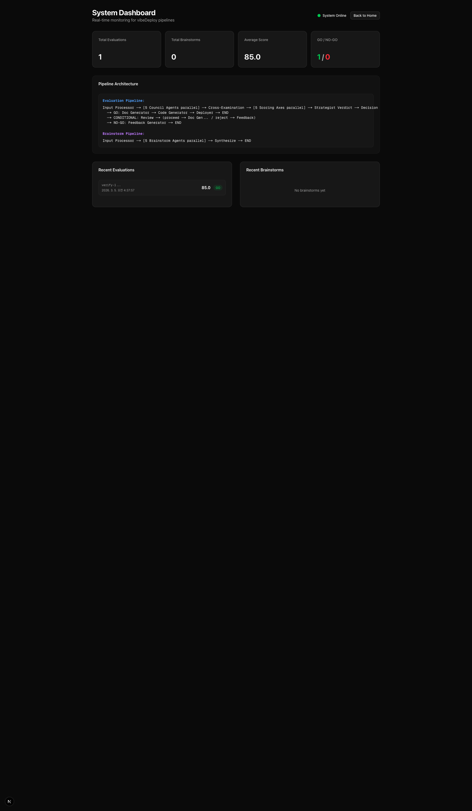
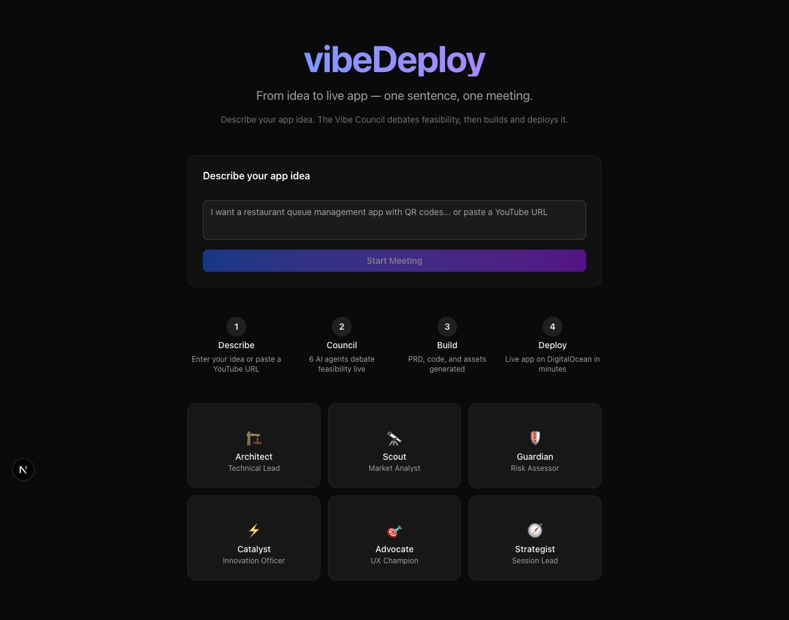
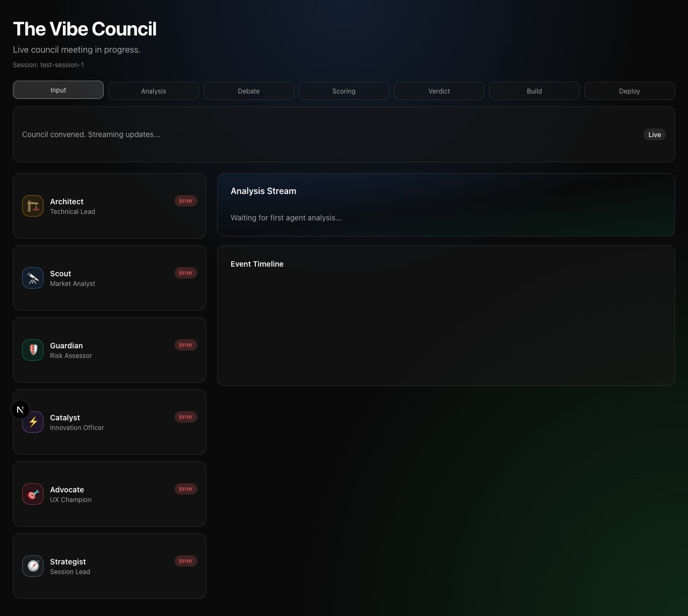
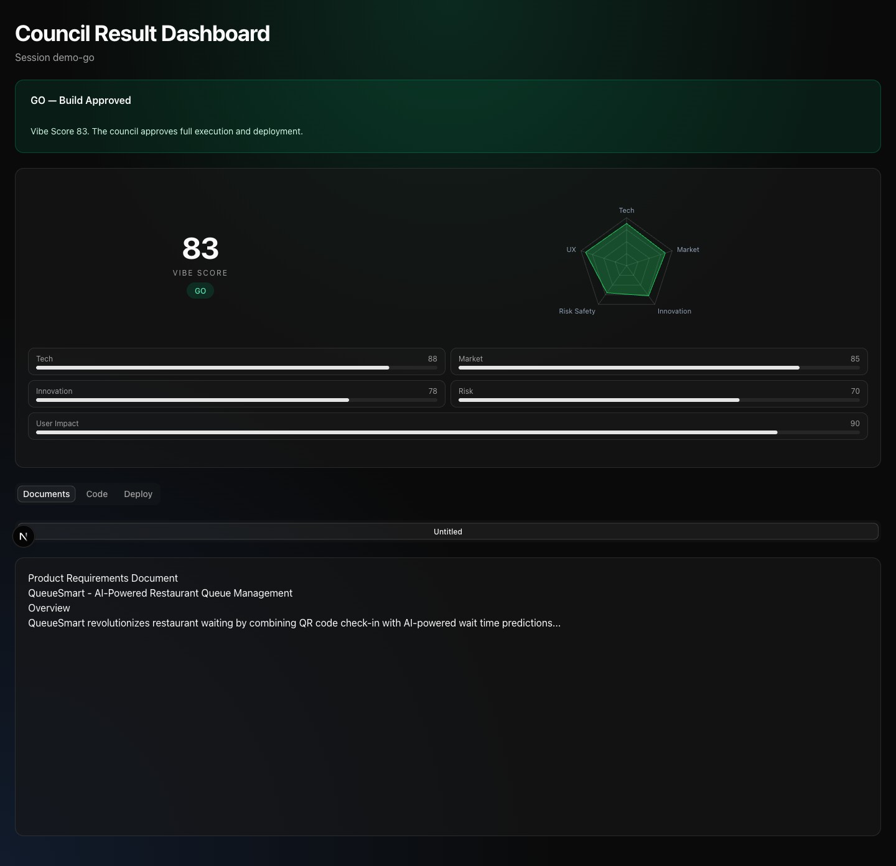
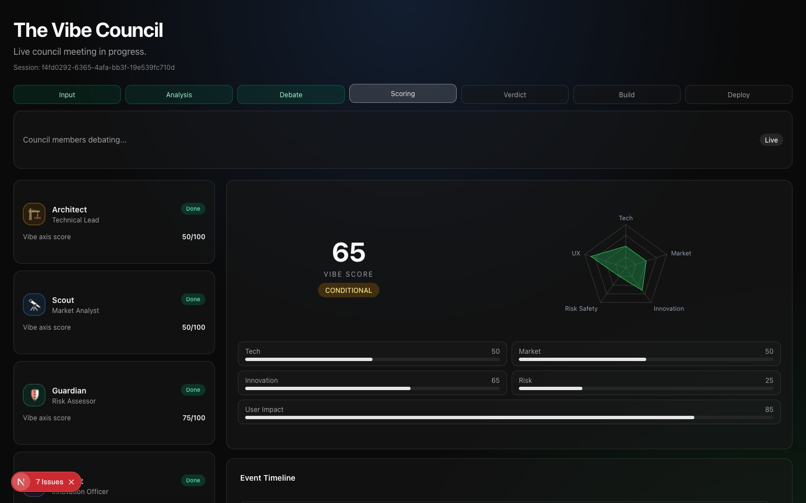

<p align="center">
  
</p>

<h1 align="center">vibeDeploy</h1>

<p align="center">
  <strong>Zero prompts. Zero coding. One button deploys a live app.</strong><br/>
  <em>AI agents discover ideas from YouTube, validate with academic research, write type-safe code, Docker-verify it, and ship to DigitalOcean &mdash; autonomously.</em>
</p>

<p align="center">
  <a href="https://vibedeploy-7tgzk.ondigitalocean.app"></a>
  <a href="https://youtu.be/REPLACE_WITH_VIDEO_ID"></a>
</p>

<p align="center">
  <a href="LICENSE"></a>
  <a href="https://github.com/Two-Weeks-Team/vibeDeploy/actions"></a>
  <a href="https://github.com/Two-Weeks-Team/vibeDeploy/issues"></a>
  <a href="https://github.com/Two-Weeks-Team/vibeDeploy/pulls"></a>
</p>

<p align="center">
  
  
  
  
  
  
</p>

<p align="center">
  <a href="#the-problem">Problem</a> &bull;
  <a href="#the-solution">Solution</a> &bull;
  <a href="#zero-prompt-start">Zero-Prompt</a> &bull;
  <a href="#contract-first-validate-always">Architecture</a> &bull;
  <a href="#the-vibe-council">Council</a> &bull;
  <a href="#live-demos">Demos</a> &bull;
  <a href="#digitalocean-gradient-ai-deep-integration">Gradient AI</a> &bull;
  <a href="#getting-started">Get Started</a>
</p>

---

## The Problem

Every AI code generator today shares the same fatal flaw: **they stop at code.**

| What they promise | What actually happens |
|---|---|
| "Build any app with AI" | TypeScript that fails `tsc`, Python with broken imports |
| "Deploy instantly" | You still need to set up hosting, DB, CI/CD yourself |
| "Production-ready" | ~40-50% of AI-generated apps even compile |
| "Just describe your idea" | You still need prompt engineering skills |
| "Smart code generation" | Single monolithic blob &mdash; one error kills 20 files |

The result? **99% of "vibe coded" apps never make it to a live URL.**

The gap isn't in code generation &mdash; it's in **validation, type safety, and deployment automation**.

---

## The Solution

**vibeDeploy** closes the entire gap from idea to live app. It's not another code generator &mdash; it's an **autonomous deployment platform** built on DigitalOcean Gradient AI.

### What makes it fundamentally different

| Traditional Vibe Coding | vibeDeploy |
|---|---|
| Generate code only | Idea to **live deployed app** with URL |
| Single LLM generates 20 files as one blob | **Per-file generation** with AST validation per file |
| Regex-based code checks | **Docker SDK** &mdash; actual `npm run build` in container |
| No type safety between FE/BE | **OpenAPI 3.1** as single source of truth for all types |
| Hope-based deployment | **Contract-First, Validate-Always** with 4-tier verification |
| Prompt engineering required | **Zero-Prompt** &mdash; one button, fully autonomous |
| ~40% deploy success rate | **~90-95%** deploy success rate |

### Three Modes

| Mode | Input | Output |
|------|-------|--------|
| **Zero-Prompt Start** | One button click | 10 validated GO ideas + auto-deploy |
| **Evaluate** | One sentence or YouTube URL | Vibe Council debate + live deployed app |
| **Brainstorm** | One sentence | Creative brief from 5 expert AI agents |

---

## Zero-Prompt Start

The flagship feature. Press **Start** and walk away. vibeDeploy's 9 specialized AI agents autonomously discover, validate, and rank app ideas from YouTube &mdash; with academic research backing.

### How it works

```
[Start Button]
      |
      v
  YouTube Discovery ---- Trending videos, engagement filter, category rotation
      |
      v
  === Streaming Loop (one video at a time) ===
  |                                          |
  |  1. Transcript extraction (free)         |
  |  2. Idea extraction (Gemini structured)  |
  |  3. Paper search (OpenAlex + arXiv)      |
  |  4. Brainstorm (idea + papers = boost)   |
  |  5. Competitive analysis (Brave + Exa)   |
  |  6. GO/NO-GO verdict (score >= 65)       |
  |                                          |
  |  GO   --> Kanban board (max 10)          |
  |  NOGO --> next video + reason shown      |
  |                                          |
  === Loop until 10 GO ideas collected ======+
      |
      v
  User clicks "GO!" on any idea
      |
      v
  Build Pipeline kicks in --> Live URL in 3-8 minutes
```

### Real-time Kanban + Action Feed

Everything streams live. No loading screen &mdash; you watch the AI agents work.

```
+------------+--------------+------------+---------+-----------+
| Exploring  | GO Ready     | Building   | Deployed| NO-GO     |
+------------+--------------+------------+---------+-----------+
| Video #12  | Pet Health   | Tax Auto   | Trans-  | AI Work-  |
| Analyzing  | score: 87    | build 63%  | lation  | flow      |
|            | [Build] [Pass]|           | LIVE    | score: 32 |
+------------+--------------+------------+---------+-----------+

Action Feed (streaming SSE):
[00:12] YouTube: Selected "AI Health Monitoring" (engagement: 94%)
[00:17] Transcript: 4,231 tokens extracted (auto captions)
[00:22] Idea: "AI Pet Health Tracker" (confidence: 0.87)
[00:28] Papers: 3 found via OpenAlex -- "Vet AI diagnostics 94% accuracy"
[00:33] Brainstorm: novelty_boost +0.18 (unexplored: Korea pet market)
[00:38] Competition: 2 competitors found, saturation: LOW
[00:41] VERDICT: GO (score: 87) -- strong differentiation, growing market
```

### Zero-Prompt Cost Efficiency

| Resource | Cost |
|----------|------|
| YouTube Data API + Transcripts | Free |
| Gemini Flash Lite (30-50 videos) | ~$0.15-0.25 |
| Paper search (OpenAlex + arXiv) | Free |
| Competitive search (Brave + Exa) | Free |
| **10 validated GO ideas** | **~$0.20 total** |

---

## Contract-First, Validate-Always

This is the architectural pivot that changed our deploy success rate from ~40% to ~90%+. Every competing tool generates code and hopes it works. vibeDeploy **defines the contract first, then validates every layer**.

### The 6-Phase Pipeline

```
Phase 1: Idea Refinement
  input_processor --> inspiration_agent --> experience_agent --> enrich_idea

Phase 2: Vibe Council (optional -- "skip to build" available)
  5 agents in parallel (LangGraph Send API) --> cross-exam --> scoring --> verdict

Phase 3: Contract Generation (the pivot)
  LLM --> OpenAPI 3.1 spec (structured output)
        |
        +--> TypeScript types (.d.ts)    -- derived from OpenAPI
        +--> Pydantic models (schemas.py) -- derived from OpenAPI
        +--> Type-safe API client         -- derived from OpenAPI
  Result: Frontend + Backend guaranteed type-compatible

Phase 4: Layered Code Generation
  Layer 1: Deterministic scaffold (0% failure)
    package.json, tsconfig, next.config, requirements.txt, main.py
  Layer 2: Auto-generated types (0% failure)
    src/types/api.d.ts, schemas.py, src/lib/api-client.ts
  Layer 3: Design system from blueprint (5% failure)
    OKLCH color tokens, next/font pairings, Framer Motion presets
  Layer 4: LLM business logic -- per-file calls (15-25% per file)
    page.tsx, components/*.tsx, routes.py, ai_service.py
  Layer 5: Domain-specific seed data
    Realistic sample data for 5 domains (recipe, project, analytics, social, ecommerce)

Phase 5: 4-Tier Build Validation
  Tier 1: Syntax (< 1s)   -- ast.parse() for Python, brace-balance for TSX
  Tier 2: Import (< 3s)   -- importlib check, package.json cross-reference
  Tier 3: Docker build (30-60s) -- actual npm run build + pip install in container
  Tier 4: Contract (< 5s) -- OpenAPI endpoints vs FastAPI routes cross-check
  FAIL? --> stderr fed back to LLM --> targeted per-file regeneration
            temperature decay: 0.10 --> 0.05 --> 0.02 (max 3 retries)

Phase 6: Deploy + Health Gate
  GitHub repo created --> DO App Platform --> /health smoke test --> LIVE URL
```

### Why This Matters

| Metric | Before Pivot | After Pivot |
|--------|-------------|-------------|
| Deploy success rate | ~40-50% | ~90-95% |
| Type compatibility (FE/BE) | ~5% | ~95%+ |
| Code generation | 1 LLM call, 20-file JSON blob | Per-file LLM calls with context |
| Build validation | Regex heuristics | Docker SDK (`docker.from_env()`) |
| Error recovery | Full regeneration | Targeted single-file with temperature decay |
| Design consistency | Hardcoded CSS | OKLCH 12-step scale + next/font pairs |

---

## The Vibe Council

When you have a specific idea, **The Vibe Council** &mdash; 6 AI agents with distinct expertise &mdash; holds a live, structured debate before building.

| Agent | Expertise | Asks |
|-------|-----------|------|
| **Architect** | Tech stack, feasibility, complexity | "Can we build this reliably?" |
| **Scout** | Market size, competition, trends | "Is there demand for this?" |
| **Guardian** | Security, legal, failure modes | "What will go wrong?" |
| **Catalyst** | Innovation, disruption, uniqueness | "What makes this 10x special?" |
| **Advocate** | UX, accessibility, user delight | "Will people love using this?" |
| **Strategist** | Synthesis, scoring, final verdict | "Build or not build?" |

### 4-Phase Meeting

```
Phase 1: INDIVIDUAL ANALYSIS    5 agents analyze in parallel (LangGraph Send API)
Phase 2: CROSS-EXAMINATION      Architect<->Guardian, Scout<->Catalyst, Advocate challenges
Phase 3: SCORING                 Each agent scores 0-100 on their axis
Phase 4: VERDICT                 Vibe Score --> GO / CONDITIONAL / NO-GO
```

```
Vibe Score = (Tech x 0.25) + (Market x 0.20) + (Innovation x 0.20)
           + ((100 - Risk) x 0.20) + (UserImpact x 0.15)

>= 70  GO           --> Build pipeline starts
50-69  CONDITIONAL   --> Scope reduction proposed
< 50   NO-GO         --> Failure report + alternatives
```

---

## Live Demos

Every app was generated from a **single sentence**, debated by the Vibe Council, Docker-build-validated, and deployed automatically.

| App | Input | Score | Stack | URL |
|-----|-------|:-----:|-------|-----|
| **QueueBite** | "Restaurant queue management with AI wait-time prediction" | 78.5 | Next.js + FastAPI + PostgreSQL | [Live](https://queuebite-784480-b4ioa.ondigitalocean.app) |
| **SpendSense AI** | "Expense tracking with AI categorization & savings" | 81.2 | Next.js + FastAPI + PostgreSQL | [Live](https://spendsense-ai-784610-pgpjp.ondigitalocean.app) |
| **PawPulse** | "Pet health monitoring with AI symptom checker" | 75.8 | Next.js + FastAPI + PostgreSQL | [Live](https://pawpulse-784798-f5nm2.ondigitalocean.app) |
| **StudyMate Lite** | "AI flashcard generator with spaced repetition" | 75.0 | Next.js + FastAPI + PostgreSQL | [Live](https://studymate-lite-060111-5pth7.ondigitalocean.app) |

Every generated app includes: FastAPI with `/health` endpoint, Next.js with OKLCH design tokens and next/font typography, PostgreSQL, AI service via DO Inference, and CI/CD on DO App Platform.

<details>
<summary><strong>Screenshots</strong></summary>
<br/>
<p align="center">
  
</p>
<p align="center">
  
  
</p>
<p align="center">
  
  
</p>
</details>

---

## DigitalOcean Gradient AI Deep Integration

vibeDeploy leverages **13 distinct DigitalOcean Gradient AI features** &mdash; the platform itself, not just inference calls. DO Gradient handles the entire agent lifecycle: hosting, evaluation, tracing, security, deployment, and storage. External LLMs are interchangeable models accessed through our Provider Adapter Registry.

### All 13 Gradient Features

| # | Feature | What vibeDeploy Does With It | Code |
|---|---------|------------------------------|------|
| 1 | **ADK** | `@entrypoint` for request streaming; `gradient agent deploy` for production | `agent/main.py` |
| 2 | **Knowledge Bases (RAG)** | Two KBs: DO deployment docs + framework best practices | `agent/tools/knowledge_base.py` |
| 3 | **Evaluation** | 25 test cases measuring generated app quality across structured metrics | `agent/evaluations/` |
| 4 | **Guardrails** | Content moderation + jailbreak detection on all inputs | `agent/guardrails.py` |
| 5 | **Tracing** | `@trace_tool` and `@trace_llm` on every tool and LLM call | `agent/llm.py`, `agent/tools/*.py` |
| 6 | **Multi-Agent Routing** | 6 Council agents + 9 Zero-Prompt agents via LangGraph Send API | `agent/gradient/router.py` |
| 7 | **A2A Protocol** | Zero-Prompt discovery hands off GO ideas to build pipeline | `agent/gradient/a2a.py` |
| 8 | **Serverless Inference** | All LLM calls route through Provider Adapter Registry | `agent/providers/registry.py` |
| 9 | **App Platform** | vibeDeploy itself AND all generated apps deploy here | `.do/app.yaml` |
| 10 | **Spaces** | Build artifacts, source archives, logs stored in S3 | `agent/tools/spaces.py` |
| 11 | **Image Generation** | App logos + OG images via DO Inference | `agent/tools/image_gen_do.py` |
| 12 | **Agent Versioning** | A/B test pipeline changes with rollback | `agent/gradient/versioning.py` |
| 13 | **MCP Integration** | DO platform APIs via Model Context Protocol | `agent/gradient/mcp_client.py` |

### Provider Adapter Registry

External models are pluggable, not hardcoded. Switch any model without touching platform code.

| Role | Model | Provider | Why |
|------|-------|----------|-----|
| Zero-Prompt Discovery | Gemini 3.1 Flash Lite | Google | High-speed structured output |
| Council Agents | Claude Sonnet 4.6 | Anthropic | Deep reasoning for debate |
| Code Generation | GPT 5.3 Codex | DO Inference | Per-file code quality |
| Strategist / Docs | GPT 5.4 | DO Inference | Synthesis + specification |
| Image Generation | GPT-image-1 | DO Inference | Logos + OG images |

**Cost per full pipeline run (idea to live app): ~$0.50-1.00**

---

## Architecture

```
                      +------------------------------------------+
                      |       vibeDeploy  (DO App Platform)       |
User                  |  +---------------+  +-----------------+  |
Browser <-- SSE --->  |  | Next.js 15    |  | FastAPI Gateway  |  |
                      |  | Dashboard     |  | Session Mgmt    |  |
                      |  | Zero-Prompt   |  | SSE Relay       |  |
                      |  | Kanban + Feed |  | Build Queue     |  |
                      |  +------+--------+  +--------+--------+  |
                      +---------|---------------------|----------+
                                |                     |
                                v                     v
                +----------------------------------+---+
                |      Gradient ADK Runtime             |
                |  @entrypoint -> LangGraph StateGraph  |
                |                                       |
                |  Zero-Prompt   Evaluation   Brainstorm |
                |  Pipeline      Pipeline     Pipeline   |
                |  (9 agents)    (20 nodes)   (6 agents) |
                +--+-------+--------+--------+-------+--+
                   |       |        |        |       |
            +------+ +-----+--+ +---+---+ +-+-----+ +--------+
            | DO    | | DO KB  | | DO    | |Managed| |Provider|
            |Spaces | | (RAG)  | |Traces | |Postgres| |Adapter|
            +-------+ +--------+ +-------+ +-------+ |Registry|
                                                      +--------+
                                                      [Gemini][Claude][GPT]
```

### Key Design Decisions (ADRs)

| ADR | Decision | Rationale |
|-----|----------|-----------|
| A0 | Google GenAI SDK for Zero-Prompt | Fastest structured output for idea extraction |
| A1 | Provider Adapter Registry | Swap models without code changes; surcharge-aware pricing |
| A2 | PostgreSQL for sessions + lineage | Full traceability: video -> idea -> card -> build -> deploy |
| A3 | Docker SDK for build validation | Real compilation in isolated containers, not regex |
| B1 | FIFO build queue, max 1 concurrent | Cost-predictable, credit-safe for hackathon |
| B2 | GO threshold = 65 | Deterministic, reproducible scoring |
| B3 | Per-file code generation | Targeted regeneration; one bad file doesn't kill the build |

---

## Tech Stack

| Layer | Technology | DO Service |
|-------|-----------|------------|
| Frontend | Next.js 16.1, Tailwind CSS v4, Framer Motion | App Platform |
| Backend | Python 3.12, FastAPI, uvicorn, SSE streaming | App Platform |
| Agent Runtime | Gradient ADK 0.2.11, LangGraph StateGraph | Gradient ADK |
| Database | PostgreSQL 16 (sessions, lineage, Zero-Prompt cards) | Managed PostgreSQL |
| Storage | S3-compatible (build artifacts, archives) | DO Spaces |
| Build Validation | Docker SDK (`docker.from_env()`) | Docker on App Platform |
| Observability | `@trace_tool`, `@trace_llm`, structured logging | Gradient Tracing |
| CI/CD | GitHub Actions: pytest-cov (80%), ruff, ESLint, tsc, bandit, mypy | Auto-deploy on push |

---

## Getting Started

### Prerequisites

- Python 3.12+, Node.js 20+, Docker
- [Gradient CLI](https://docs.digitalocean.com/products/gradient-ai-platform/getting-started/)
- [DigitalOcean account](https://mlh.link/digitalocean-signup) ($200 free credits)

### Local Development

```bash
# 1. Clone
git clone https://github.com/Two-Weeks-Team/vibeDeploy.git
cd vibeDeploy

# 2. Agent backend (Python 3.12+)
cd agent/
python3 -m venv .venv && source .venv/bin/activate
pip install -r requirements.txt
cp .env.example .env              # Fill in your API keys (see below)
python run_server.py              # Starts FastAPI on :8080

# 3. Frontend (Node.js 20+, new terminal)
cd web/
npm ci
NEXT_PUBLIC_AGENT_URL=http://localhost:8080 npm run dev
# Open http://localhost:3000
```

### Verify Everything Works

```bash
# Agent: lint + 1285 tests
cd agent/
ruff check . && ruff format --check .
pytest tests/ -v --tb=short       # Expect: 1285 passed

# Web: lint + 8 tests + build
cd web/
npx eslint .
npm test                          # Expect: 8 passed
NEXT_PUBLIC_AGENT_URL=http://localhost:8080 npm run build
```

### Environment Variables

Copy `agent/.env.example` to `agent/.env` and fill in:

```bash
# === Required (core pipeline) ===
DIGITALOCEAN_API_TOKEN=...         # DO API — deploy generated apps
DIGITALOCEAN_INFERENCE_KEY=...     # DO Inference — LLM calls via Provider Registry
GOOGLE_API_KEY=...                 # Gemini — Zero-Prompt idea extraction
ANTHROPIC_API_KEY=...              # Claude — Vibe Council debate
OPENAI_API_KEY=...                 # GPT — code generation + strategist
GITHUB_TOKEN=...                   # GitHub — repo creation for deploys
DATABASE_URL=...                   # PostgreSQL connection string

# === Required (Zero-Prompt) ===
YOUTUBE_DATA_API_KEY=...           # YouTube Data API v3 — video discovery
BRAVE_API_KEY=...                  # Brave Search — competitive analysis

# === Optional ===
GRADIENT_MODEL_ACCESS_KEY=...      # Alias for DIGITALOCEAN_INFERENCE_KEY
DO_KNOWLEDGE_BASE_ID=...           # DO Knowledge Base for RAG
SPACES_ACCESS_KEY_ID=...           # DO Spaces — artifact storage
SPACES_SECRET_ACCESS_KEY=...       # DO Spaces secret
EXA_API_KEY=...                    # Exa Search — parallel competitive analysis
GITHUB_ORG=...                     # GitHub org for generated repos
```

---

## Deployment

**Live: [https://vibedeploy-7tgzk.ondigitalocean.app](https://vibedeploy-7tgzk.ondigitalocean.app)** | [Deployment Status](docs/DEPLOYMENT_STATUS.md) | [E2E Verification](docs/E2E_VERIFICATION.md)

### Step-by-Step Deploy

```bash
# Prerequisites: gradient CLI, doctl CLI, DIGITALOCEAN_API_TOKEN set
# See: https://docs.digitalocean.com/products/gradient-ai-platform/getting-started/

# 1. Deploy Gradient ADK agent (orchestration core)
cd agent
gradient secret set DIGITALOCEAN_INFERENCE_KEY="$DIGITALOCEAN_INFERENCE_KEY"
gradient secret set DIGITALOCEAN_API_TOKEN="$DIGITALOCEAN_API_TOKEN"
gradient secret set GITHUB_TOKEN="$GITHUB_TOKEN"
gradient agent deploy
# Note the Agent URL from output (e.g., https://agents.do-ai.run/...)

# 2. Deploy App Platform (gateway + web + DB)
cd ..
doctl apps create --spec .do/app.yaml
# Or use auto-deploy: push to main branch triggers deploy

# 3. Verify
curl https://YOUR_APP_URL/health    # Should return {"status": "ok"}
curl https://YOUR_APP_URL/api/models # Should list available models
```

### One-Command Deploy (via script)

```bash
# Sets secrets, deploys ADK agent, renders app spec, updates App Platform
export DIGITALOCEAN_API_TOKEN=...
export DIGITALOCEAN_INFERENCE_KEY=...
export GITHUB_TOKEN=...
cd agent && bash scripts/deploy.sh
```

### Observability

```bash
gradient agent logs                  # Live agent logs
gradient agent traces                # Distributed tracing
```

---

## Project Structure

```
vibeDeploy/
|-- agent/                          # Python Runtime -> Gradient ADK
|   |-- main.py                     # @entrypoint (ADK streaming)
|   |-- server.py                   # FastAPI gateway + SSE + Zero-Prompt API
|   |-- graph.py                    # Evaluation pipeline (LangGraph)
|   |-- graph_brainstorm.py         # Brainstorm pipeline
|   |-- nodes/                      # 20+ pipeline nodes
|   |   |-- build_validator.py      # Docker SDK build validation
|   |   |-- scaffold_generator.py   # Deterministic scaffold (L1)
|   |   |-- api_contract_generator.py # OpenAPI 3.1 generation (L2)
|   |   |-- type_generator.py       # OpenAPI -> TS types + API client
|   |   |-- pydantic_generator.py   # OpenAPI -> Pydantic models
|   |   |-- design_tokens.py        # OKLCH color system (L3)
|   |   |-- per_file_code_generator.py # Per-file LLM calls (L4)
|   |   |-- per_file_regeneration.py   # Temperature decay retry
|   |   |-- contract_validator.py   # OpenAPI vs routes cross-check
|   |   |-- deployer.py             # GitHub + App Platform + /health gate
|   |   +-- ...
|   |-- zero_prompt/                # Zero-Prompt autonomous pipeline
|   |   |-- orchestrator.py         # Streaming loop + session management
|   |   |-- discovery.py            # YouTube trending exploration
|   |   |-- insight_extractor.py    # Gemini structured idea extraction
|   |   |-- paper_search.py         # OpenAlex + arXiv
|   |   |-- paper_brainstorm.py     # LLM brainstorm with papers
|   |   |-- competitive_analysis.py # Brave + Exa parallel search
|   |   |-- verdict.py              # Deterministic GO/NO-GO scoring
|   |   |-- events.py               # SSE event definitions
|   |   +-- schemas.py              # ZPSession, ZPCard, Verdict models
|   |-- providers/                  # Multi-vendor adapter registry
|   |-- gradient/                   # A2A, MCP, versioning, router
|   |-- evaluations/                # Quality evaluation (25 test cases)
|   |-- db/                         # PostgreSQL store + lineage + metrics
|   +-- tests/                      # 77 test files, 1285+ tests
|-- web/                            # Next.js Frontend -> App Platform
|   |-- src/app/                    # Routes: landing, meeting, brainstorm, zero-prompt, dashboard
|   |-- src/components/zero-prompt/ # Kanban board, action feed, idea cards
|   |-- src/hooks/                  # SSE hooks, pipeline monitor, build queue
|   +-- src/lib/                    # API modules (dashboard, zero-prompt, meeting, brainstorm)
|-- .do/app.yaml                    # App Platform spec (api + web)
|-- .github/workflows/ci.yml       # CI: pytest-cov 80%, ruff, ESLint, tsc, bandit, mypy
|-- docs/reference/                 # 35+ architecture & spec documents
+-- LICENSE                         # MIT
```

---

## What We Built

### Numbers

| Metric | Value |
|--------|-------|
| Lines of Python (agent) | ~25,000+ |
| Lines of TypeScript (web) | ~5,000+ |
| Pipeline nodes | 20+ |
| Zero-Prompt agents | 9 |
| Vibe Council agents | 6 |
| Test files | 77 |
| Architecture docs | 35+ |
| DO Gradient features | 13 |
| Deploy success rate (post-pivot) | ~90-95% |
| Live demo apps | 4 |
| Cost per deployment | ~$0.50-1.00 |

### Challenges We Overcame

1. **~40% deploy success to ~90%+** &mdash; The original single-shot code generator produced broken apps half the time. We redesigned the entire pipeline: deterministic scaffolds, OpenAPI contracts, per-file generation, and Docker-based validation turned "hope it compiles" into "we proved it compiles."

2. **Docker build validation on App Platform** &mdash; Running `npm run build` inside Docker containers required careful resource limits (512MB RAM) and network isolation. Graceful degradation when Docker isn't available was essential.

3. **Streaming SSE across dual deployment** &mdash; The ADK runtime and App Platform gateway are separate services. Relaying SSE events without dropped connections required careful buffering and reconnection logic.

4. **Per-file regeneration with context preservation** &mdash; When one file fails AST validation, regenerating only that file while maintaining cross-file imports and type references required passing the full generation context on each retry, with temperature decay (0.10 -> 0.05 -> 0.02).

5. **Academic API rate limits** &mdash; arXiv's 1-request-per-3-seconds throttle with Zero-Prompt's streaming loop required async queuing with OpenAlex as primary source and arXiv as fallback.

### What We Learned

- **"Validate-Always" is non-negotiable for AI code generation.** Every competing tool that succeeds (bolt.new, Lovable, v0) validates before deploying. Regex checks are theater.
- **Docker SDK (`docker.from_env()`)** catches ~95% of build issues vs ~40% with heuristics. The 30-60 second cost per validation is worth every second.
- **OpenAPI as single source of truth** eliminates the entire category of FE/BE type mismatch bugs.
- **Per-file generation** is dramatically more reliable than monolithic blob generation. When one file fails, you fix one file &mdash; not 20.
- **DigitalOcean Gradient ADK** makes agent deployment remarkably simple &mdash; `gradient agent deploy` handles everything from containerization to endpoint management.
- **Streaming UX transforms waiting into watching.** The Manus-style action feed made users stay engaged instead of switching tabs.

---

## Hackathon

<table>
  <tr>
    <td><strong>Event</strong></td>
    <td><a href="https://digitalocean.devpost.com/">DigitalOcean Gradient&trade; AI Hackathon 2026</a></td>
  </tr>
  <tr>
    <td><strong>Total Prizes</strong></td>
    <td>$20,000 (1st: $8,000 + $600 DO credits)</td>
  </tr>
  <tr>
    <td><strong>Deadline</strong></td>
    <td>March 18, 2026, 5:00 PM EDT</td>
  </tr>
  <tr>
    <td><strong>Team</strong></td>
    <td><a href="https://github.com/Two-Weeks-Team">Two-Weeks-Team</a></td>
  </tr>
</table>

### How We Address Each Judging Criterion

| Criterion (25% each) | Evidence |
|----------------------|----------|
| **Technological Implementation** | 13 DO Gradient features. Contract-First architecture with OpenAPI single source of truth. Docker SDK build validation. Per-file code generation with AST validation. Provider Adapter Registry for multi-vendor LLM routing. 4-tier build verification pipeline. 69 test files, 80% coverage, mypy strict. |
| **Design** | Manus-style real-time action feed. 5-column Kanban with live SSE updates. OKLCH 12-step design token system for generated apps. Framer Motion animations. 10 next/font typography pairings. 8 layout archetypes (CSS Grid + Flexbox). Mobile-responsive dashboard. |
| **Potential Impact** | Democratizes app deployment &mdash; zero coding, zero prompts, zero DevOps knowledge required. Academic paper validation adds scientific rigor to AI ideation that no competitor offers. MIT-licensed for open-source community adoption. Every generated app is production-grade with health checks and CI/CD. |
| **Quality of the Idea** | First platform combining **(1)** autonomous idea discovery from YouTube with academic validation, **(2)** multi-agent structured debate, and **(3)** contract-first validated deployment. The pivot from "generate and pray" to "define, validate, and verify" is an architectural innovation, not just a feature. |

### Prize Fit

| Prize | Why vibeDeploy |
|-------|---------------|
| **1st Place** | Deepest Gradient integration (13 features), complete paradigm: discovery -> validation -> deployment |
| **Best AI Agent Persona** | 15 agents with distinct roles: 6 Council debaters + 9 Zero-Prompt specialists |
| **Great Whale Prize** | Largest scope: autonomous YouTube discovery -> academic validation -> type-safe code gen -> Docker build -> live deployment |
| **Best for the People** | MIT-licensed, zero technical knowledge required, generates production-grade apps anyone can use |

---

## License

[MIT](LICENSE)

---

<p align="center">
  <sub>Built with DigitalOcean Gradient&trade; AI for the <a href="https://digitalocean.devpost.com/">DigitalOcean Gradient AI Hackathon 2026</a></sub>
  <br/>
  <sub>By <a href="https://github.com/Two-Weeks-Team">Two-Weeks-Team</a></sub>
</p>
