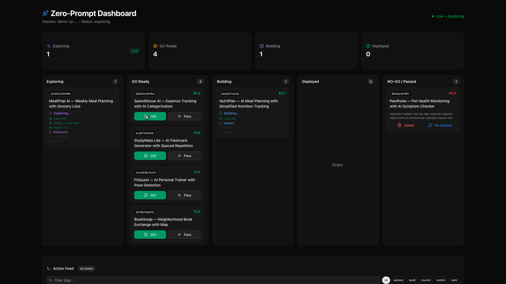

<h1 align="center">vibeDeploy</h1>

<p align="center">
  <strong>One click starts discovery. A live Kanban ranks ideas. You choose a GO card to build. vibeDeploy ships the app to DigitalOcean.</strong><br/>
  <em>Zero-Prompt discovery, AI evaluation, type-safe code generation, build validation, and deployment in one flow.</em>
</p>

<p align="center">
  <a href="https://vibedeploy-7tgzk.ondigitalocean.app"></a>
  <a href="https://github.com/Two-Weeks-Team/vibeDeploy"></a>
</p>

<p align="center">
  <em>Demo video link: add the final public YouTube or Vimeo URL before submission.</em>
</p>

<p align="center">
  <a href="LICENSE"></a>
  <a href="https://github.com/Two-Weeks-Team/vibeDeploy/actions"></a>
  <a href="https://github.com/Two-Weeks-Team/vibeDeploy/issues"></a>
  <a href="https://github.com/Two-Weeks-Team/vibeDeploy/pulls"></a>
</p>

<p align="center">
  
  
  
  
  
  
</p>

<p align="center">
  
</p>

---

## Overview

`vibeDeploy` is a dual-runtime application that turns an idea into a live deployed app on DigitalOcean.

- `web/` is the Next.js 16.1.7 frontend for Zero-Prompt, evaluation, brainstorm, and operational views.
- `agent/` is the Python 3.12.4 backend that runs the Gradient ADK entrypoint, FastAPI gateway, LangGraph pipelines, and deployment orchestration.
- The flagship flow is `Zero-Prompt Start`: one click starts discovery, a live Kanban fills with GO and NO-GO ideas, and the user picks a GO card to build.

## Main Flow

```text
One click starts Zero-Prompt discovery
  -> YouTube discovery selects candidate videos
  -> transcript extraction pulls source material
  -> Gemini extracts the app idea
  -> paper search adds academic context
  -> competitive analysis checks saturation
  -> deterministic scoring marks GO / NO-GO
  -> live Kanban shows the ranked cards
  -> user clicks Build on a GO card
  -> contract-first code generation runs
  -> validation + deploy produce a live app URL
```

## Product Modes

| Mode | Input | Output |
|---|---|---|
| `Zero-Prompt Start` | One click | Live Kanban of GO / NO-GO ideas, then on-demand build |
| `Evaluate` | One sentence or YouTube URL | Vibe Council score, verdict, and optional build |
| `Brainstorm` | One sentence | Structured idea expansion and product brief |

## Why The Flow Works

- `Contract-first generation` keeps frontend and backend aligned through OpenAPI-derived types and models.
- `Layered generation` separates deterministic scaffolds from LLM-written business logic.
- `Validation before deploy` includes syntax, imports, build checks, and contract verification.
- `Live streaming UI` turns the pipeline into a visible product experience instead of a black box.

## Public Live Apps

These public links returned `HTTP 200` during the latest submission audit.

| App | What it shows | URL |
|---|---|---|
| `NutriPlan` | AI meal planning MVP | https://nutriplan-meal-planning-818722-dei83.ondigitalocean.app |
| `FlavorSwap Lite` | Recipe and ingredient swap workflow | https://flavorswap-lite-637431-dl43t.ondigitalocean.app |
| `GardenBreak` | Lightweight habit and garden routine tracking | https://gardenbreak-377462-h9bmg.ondigitalocean.app |
| `Creator Batch Studio` | Creator planning and batching workspace | https://creator-batch-studio-640303-segyb.ondigitalocean.app |

## DigitalOcean Capabilities Used

The current submission material is aligned around `13` DigitalOcean capabilities across Gradient AI and the broader deployment stack.

| # | Capability | Current use in vibeDeploy | Code |
|---|---|---|---|
| 1 | `Gradient ADK` | Agent entrypoint and deployment | `agent/main.py` |
| 2 | `Knowledge Bases` | Deployment and framework retrieval | `agent/tools/knowledge_base.py` |
| 3 | `Evaluations` | Generated app quality checks | `agent/evaluations/` |
| 4 | `Guardrails` | Input moderation and prompt safety | `agent/guardrails.py` |
| 5 | `Tracing` | Tool and LLM trace instrumentation | `agent/llm.py`, `agent/tools/*.py` |
| 6 | `Multi-Agent Routing` | Council and Zero-Prompt orchestration | `agent/gradient/router.py` |
| 7 | `A2A Handoff` | GO card handoff into build pipeline | `agent/gradient/a2a.py` |
| 8 | `Serverless Inference` | Model execution via the provider registry | `agent/providers/registry.py` |
| 9 | `App Platform` | Hosts vibeDeploy and generated apps | `.do/app.yaml` |
| 10 | `Spaces` | Archives and build artifacts | `agent/tools/spaces.py` |
| 11 | `Image Generation` | Logos and OG image generation | `agent/tools/image_gen_do.py` |
| 12 | `Agent Versioning` | Version-aware pipeline iteration | `agent/gradient/versioning.py` |
| 13 | `MCP Integration` | Platform API access | `agent/gradient/mcp_client.py` |

## Current Model Plan

These are the current default role mappings from `agent/llm.py` and the canonical registry in `agent/providers/registry.py`.

| Role | Model | Provider |
|---|---|---|
| Zero-Prompt discovery | `gemini-3.1-flash-lite-preview` | Google |
| Zero-Prompt brainstorm | `gemini-3.1-flash-lite-preview` | Google |
| Council analysis | `claude-sonnet-4-6` | Anthropic |
| Cross-exam | `claude-sonnet-4-6` | Anthropic |
| Strategist / docs | `gpt-5.4` | OpenAI |
| Code generation | `gpt-5.3-codex` | OpenAI |
| CI repair | `gpt-5.2` | OpenAI |
| UI design | `gemini-3.1-pro-preview` | Google |
| Image generation | `fal-ai/flux/schnell` | DO Inference |

## Current Stack Versions

| Layer | Current version / service |
|---|---|
| Frontend | Next.js `16.1.7`, React `19.2.4`, Tailwind CSS `4`, Framer Motion `12.37.0` |
| Backend | Python `3.12.4`, FastAPI `0.115+`, Pydantic `2.9+`, uvicorn `0.34+` |
| Agent runtime | Gradient ADK `0.2.11+`, LangGraph `1.0+`, LangChain Core `1.2.11+` |
| Database | Managed PostgreSQL |
| Storage | DigitalOcean Spaces |
| Build validation | Docker SDK |

## Local Development

```bash
# agent runtime
cd agent
python3 -m venv .venv
source .venv/bin/activate
pip install -r requirements.txt
python run_server.py

# web runtime
cd web
npm ci
NEXT_PUBLIC_AGENT_URL=http://localhost:8080 npm run dev
```

## Verify Locally

```bash
# agent
cd agent
ruff check .
ruff format --check .
pytest tests/ -v --tb=short

# web
cd web
npx eslint .
npm test
NEXT_PUBLIC_AGENT_URL=http://localhost:8080 npm run build
```

For the latest verification evidence, see `docs/E2E_VERIFICATION.md`.

## Deployment

- Live app: `https://vibedeploy-7tgzk.ondigitalocean.app`
- Deployment inventory: `docs/DEPLOYMENT_STATUS.md`
- App Platform spec: `.do/app.yaml`
- Agent deployment script: `agent/scripts/deploy.sh`

```bash
# deploy the agent
cd agent
gradient agent deploy

# deploy the app platform stack
cd ..
doctl apps create --spec .do/app.yaml
```

## Project Structure

```text
vibeDeploy/
|- agent/               # Gradient ADK entrypoint, FastAPI gateway, LangGraph pipelines
|- web/                 # Next.js app router frontend and Zero-Prompt UI
|- .do/app.yaml         # App Platform spec for api + web
|- docs/                # submission text, verification notes, reference docs
`- screenshots/         # demo and README assets
```

## License

`MIT` — see `LICENSE`.

<p align="center">
  <sub>Maintained by <a href="https://github.com/Two-Weeks-Team">Two-Weeks-Team</a></sub>
</p>
